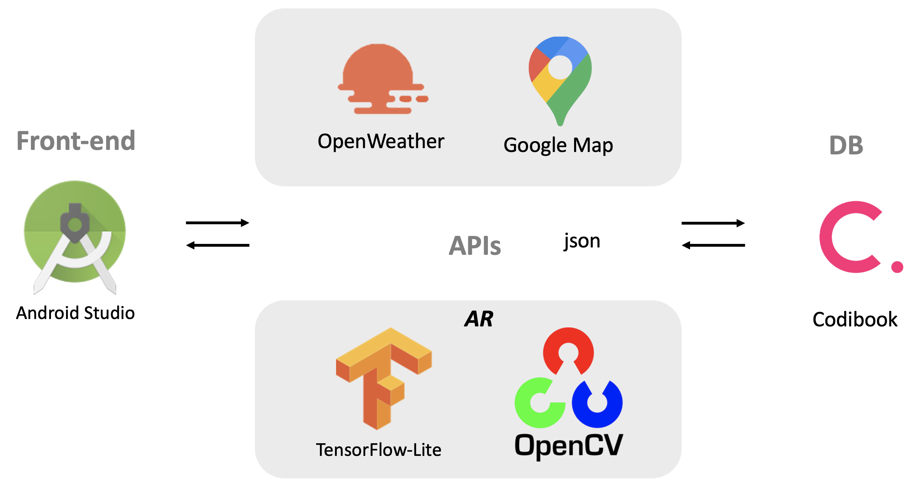

# WEATHER-LOOK

1. [프로젝트 설명 및 사용방법](#프로젝트_설명_및_사용방법)
2. [시스템 구성도](#시스템_구성도)
3. [데모](#데모)
4. [개발환경](#개발환경)
5. [라이브러리 설치 및 환경 설정](#라이브러리_설치_및_환경설정)

## 프로젝트_설명_및_사용방법
### 프로젝트 설명
Weather Look은 구글 지도 API와 open weather map API를 사용하여 날씨에 맞는 다양한 스타일의 옷들을 카테고리별로 추천해주고, OPENCV를 사용하여 사용자가 선택한 옷들을 가상으로 입어볼 수 있도록 도와줍니다. 또한 사용자가 옷이 마음에 들 경우 해당 옷의 쇼핑몰로 연결하여 바로 구매까지 할 수 있도록 도와줌으로써 사용자의 옷 스타일 고민을 줄여주고자 하는 것이 Weather Look의 목적입니다. 

### 시스템 구성도

## 데모
[데모영상](https://www.youtube.com/watch?v=gB7HxzWPQvc&feature=youtu.be)

## 개발환경
 * 개발환경: Android Studio 3.2.0, jdk-14.0.1, github 
 * 개발언어: 가상 피팅 서비스를 제공하기 위해 OPENCV 4.1 라이브러리와 TensorFlow-Lite를 사용하였으며, 해당 라이브러리는 C++, HTML, java, XML을 사용하고 있다. 안드로이드 스튜디오에서는 xml과 java를 사용하였습니다.

## 라이브러리_설치_및_환경설정

### Opencv 설치
 * [Python Opencv 설치법](http://circlestate.tistory.com/4)

### open weather map API 사용방법
 * [Google Cloud Platform 사용설정](http://circlestate.tistory.com/8)
 * [Google Cloud Platform 프로젝트 생성](http://circlestate.tistory.com/9)
 * [Google Cloud Platform 서비스 계정 생성](http://circlestate.tistory.com/10)
 * [Google Cloud Platform 환경설정 및 SDK 다운](http://circlestate.tistory.com/11)

	- 링크 참고

