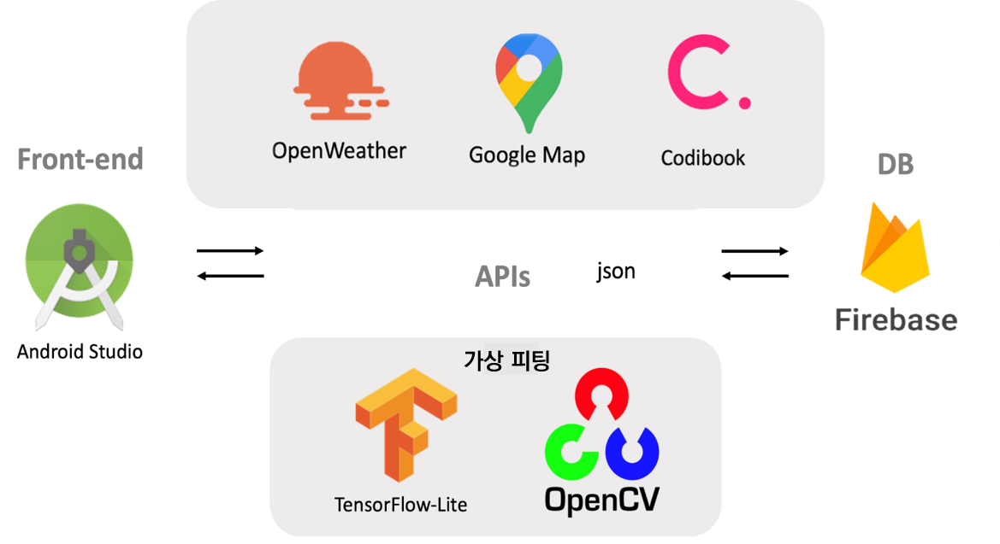

# WEATHER-LOOK

1. [프로젝트 설명 및 사용방법](#프로젝트_설명_및_사용방법)
2. [시스템 구성도](#시스템_구성도)
3. [데모](#데모)
4. [개발환경](#개발환경)
5. [라이브러리 설치 및 환경 설정](#라이브러리_설치_및_환경설정)
6. [전제사항](#전제사항)

## 프로젝트_설명_및_사용방법
### 프로젝트 설명
Weather Look은 구글 지도 API와 open weather map API를 사용하여 날씨에 맞는 다양한 스타일의 옷들을 카테고리별로 추천해주고, OPENCV를 사용하여 사용자가 선택한 옷들을 가상으로 입어볼 수 있도록 도와줍니다. 또한 사용자가 옷이 마음에 들 경우 해당 옷의 쇼핑몰로 연결하여 바로 구매까지 할 수 있도록 도와줌으로써 사용자의 옷 스타일 고민을 줄여주고자 하는 것이 Weather Look의 목적입니다. 

### 시스템 구성도

## 데모
[데모영상](https://youtu.be/DjnEKcIg3a8)

## 개발환경
 * 개발환경: Android Studio 3.2.0, jdk-14.0.1, github
 * 개발언어: 가상 피팅 서비스를 제공하기 위해 OPENCV 4.1 라이브러리와 TensorFlow-Lite를 사용하였으며, 해당 라이브러리는 C++, HTML, java, XML을 사용하고 있다. 안드로이드 스튜디오에서는 xml과 java를 사용하였습니다.

## 라이브러리_설치_및_환경설정

### Opencv 설치
 * [Python Opencv 설치법](http://circlestate.tistory.com/4)

### open weather map API 사용방법
 * [Google Cloud Platform 사용설정](http://circlestate.tistory.com/8)
 * [Google Cloud Platform 프로젝트 생성](http://circlestate.tistory.com/9)
 * [Google Cloud Platform 서비스 계정 생성](http://circlestate.tistory.com/10)
 * [Google Cloud Platform 환경설정 및 SDK 다운](http://circlestate.tistory.com/11)

	- 링크 참고

## 전제사항
 * 본 프로젝트의 범위는 스마트폰만 해당된다. 갤럭시탭이나 아이패드와 같은 다른 디바이스는 고려하지 않는다.
 * 본 프로젝트는 LCD Size가 4.0인치 이하 혹은 4.0인치 이상의 해상도에서 수행하였을 경우는 보장하지 않는다.
 * 본 프로젝트 구축에 필요한 모든 콘텐츠-이미지, 음성 파일, 동영상 파일 등-는 프로젝트 용도 외의 사용이나 무단 복제가 불가하다.
 * 본 프로젝트를 위해 사용하는 모든 콘텐츠의 저작권은 ‘Weather Look’이 갖는다.
